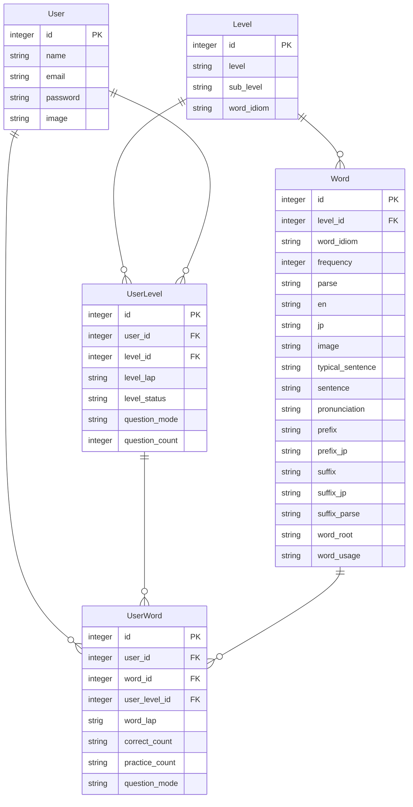
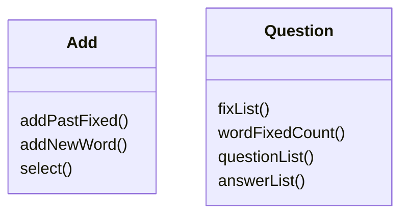
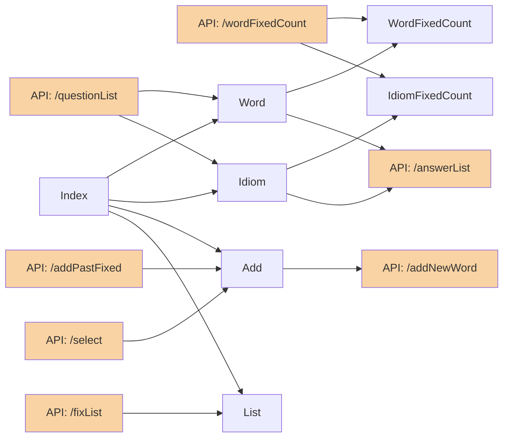
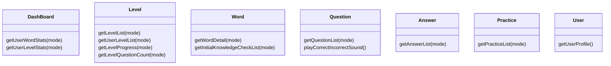
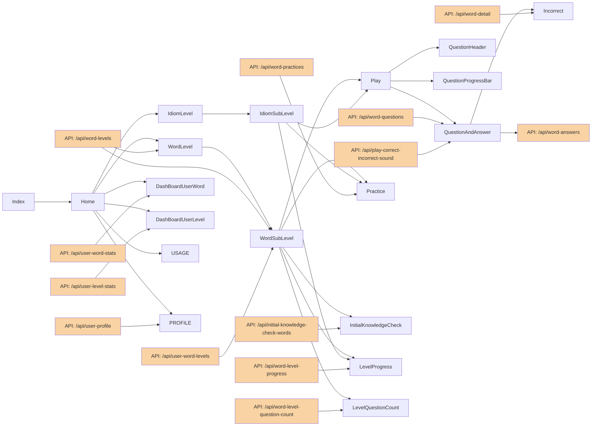
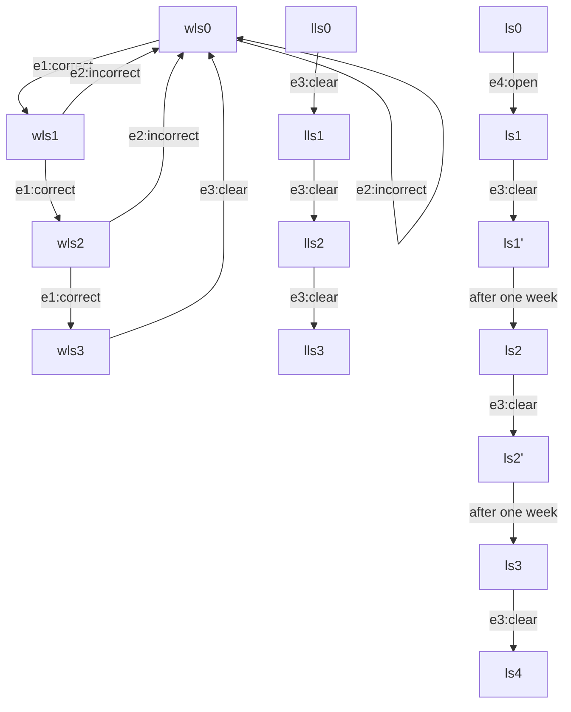

## Who's it for?
me !

## Why build it?
It is a strong need for me as an English word-learning tool.

## What is it?
This is English word learning tool.
rapidly increase English word counts in one's brain database.

## where is document?
| where is | content |
| --- | --- | --- |
|gss|Screen Transition Diagram|
|gss|UI design|
|gss|Function List|
|md|1.Database Design|
|md|2.Class Diagram|
|md|3.Component Diagram|
|md|4.State transition Diagram|

## GitHub rule
#### Branch
・main
・develop

#### commit命名ルール	
[feat]：機能追加
[fix]：不具合修正
[remove]：機能削除
[refactor]：機能再構築
[style]：css修正
[other]：その他

	

## 1.Database Design

## 2.Class Diagram(pre)

## 3.Component Diagram (pre)

## Class Diagram

## Component Diagram

## 4.State transition Diagram
#### WordLapState
| s(state) |e1:correct|e2:incorrect|e3:clear|
| --- | --- | --- | --- |
|wls0|wls1|wls0||
|wls1|wls2|wls0||
|wls2|wls3|wls0||
|wls3|||wls0|

#### LevelLapState
| s(state) |e3:clear|e4:master|
| --- | --- | --- |
|lls0|lls1||
|lls1|lls2||
|lls2|lls3||
|lls3||ls1(open)|

#### LevelState
| s(state) |e3:clear|e4:open|after one week|
| --- | --- | --- | --- | 
|ls0||ls1||
|ls1|ls1'|||
|ls1'|||ls2|
|ls2|ls2'|||
|ls2'|||ls3|
|ls3|ls4|||

